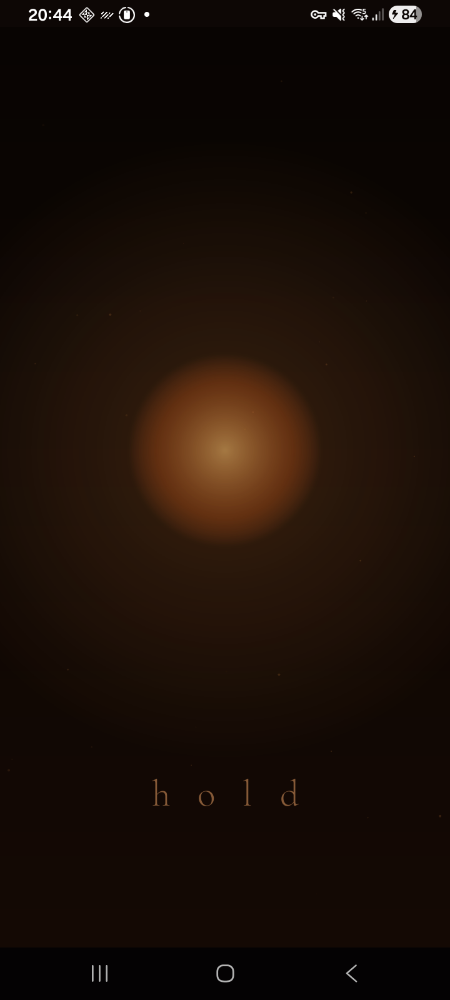
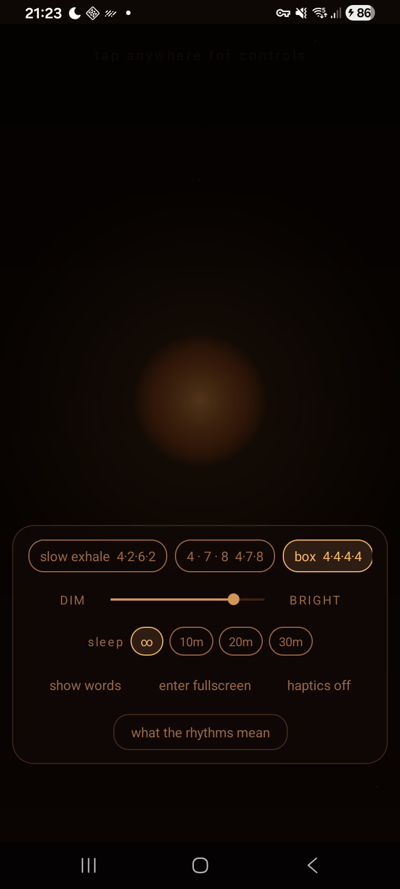
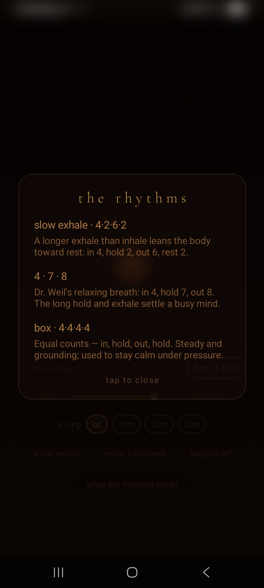

# Ember

A breathing pacer for sleep — a calm, full-screen ember you breathe with in the dark.

<p align="center">
  
</p>

Ember began as a single self-contained web page, `ember.html`, written by Claude Fable. This
repo is a native **.NET MAUI** (Android) port of it: the canvas animation is redrawn with
**SkiaSharp**, and the controls are reworked into a quiet, tap-to-open panel suited to a dark
bedroom.

## What it does

A warm, near-black screen holds a soft ember/candle glow that **grows on the inhale and shrinks
on the exhale**, with drifting spark "motes" and fading phase words (*breathe in · hold · let go
· rest*). You match your breath to it.

### Features
- **Three breathing rhythms** — slow exhale (4·2·6·2), 4·7·8, and box (4·4·4·4).
- **Tap-to-open control panel** — low-centre and translucent, on a dim scrim. Tap outside to
  dismiss; it also auto-hides when idle.
- **DIM slider** — dims both the drawing *and* the real screen backlight, for true darkness.
- **Sleep timer** — ∞ / 10 / 20 / 30 min; gently fades to black and lets the device sleep. Off
  (∞) by default; any tap restarts the countdown.
- **Haptic breathing cues** — an optional gentle buzz on each inhale/exhale so you can pace with
  your eyes closed.
- **Phase-words** toggle, a **fullscreen** (immersive) toggle, and an **info card** explaining
  the rhythms.
- Remembers your settings between launches; keeps the screen awake during a session.

<p align="center">
  
  &nbsp;&nbsp;
  
</p>

## The rhythms
- **slow exhale (4·2·6·2)** — a longer exhale than inhale leans the body toward rest.
- **4·7·8** — Dr. Weil's relaxing breath; the long hold and exhale settle a busy mind.
- **box (4·4·4·4)** — equal counts, steady and grounding.

## Build & run

Requirements:
- **.NET 10 SDK** with the **MAUI Android workload** — `dotnet workload install maui-android`.
- **Android SDK** and a connected device (or a real-GPU emulator).
- **JDK 21** — the .NET Android SDK rejects newer JDKs (`error XA0030`). Point the build at a
  JDK 21 either by copying [`Directory.Build.local.props.example`](Directory.Build.local.props.example)
  to `Directory.Build.local.props` (git-ignored) and filling in `JavaSdkDirectory`, by passing
  `-p:JavaSdkDirectory=…` on the command line, or by setting it in your IDE's Android settings.

Deploy to a connected device and launch:

```bash
dotnet build Ember/Ember.csproj -t:Run -f net10.0-android -p:AdbTarget=-d
```

(Add `-p:JavaSdkDirectory=/path/to/jdk-21` too if you haven't set up `Directory.Build.local.props`.)

> **Note:** Debug builds use **Fast Deployment** — the .NET assemblies are pushed to the device
> separately, so a bare `adb install` of the APK crashes with *"No assemblies found…"*. Always
> deploy via `-t:Run` (or your IDE's Run button). For a standalone APK, build Release or add
> `-p:EmbedAssembliesIntoApk=true`.

## Project layout
- `Ember/EmberRenderer.cs` — the SkiaSharp port of the canvas animation (rhythms, breath
  curve, motes, gradients).
- `Ember/MainPage.xaml` / `.xaml.cs` — the UI overlays and all interaction.
- `Ember/MauiProgram.cs`, `App.xaml` — app bootstrap, palette, font registration.
- `Ember/Platforms/Android/` — MAUI Android entry points and the manifest.
- `ember.html` — the original web app, kept for reference.

## Status & known issues
Built and running on-device. A few features still want on-device tuning/verification — see the
[Issues](../../issues) tab. To hack on it, see [CONTRIBUTING.md](CONTRIBUTING.md); deeper
contributor/agent notes live in [AGENTS.md](AGENTS.md).

## Credits
- Original `ember.html` by **Claude Fable**.
- Font: **Cormorant Garamond**, under the SIL Open Font License.
